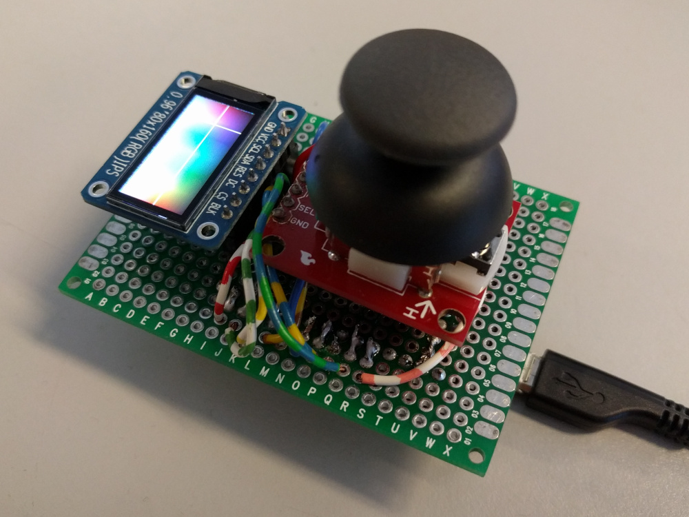
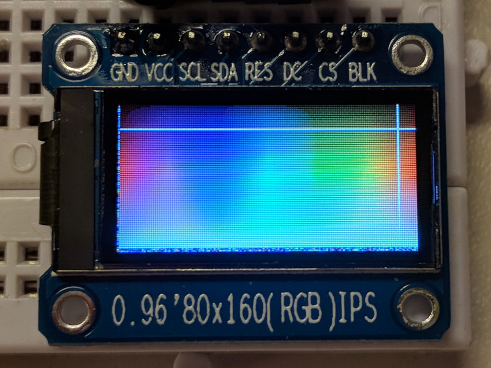

LED-Pad
=======

The LED-Pad is a simple remote control intended to be used with single color
LED-strips.

The color and brightness can be controlled via an analog joystick and a user
interface on a
[160x80 OLED display](https://nl.aliexpress.com/item/1-stks-IPS-0-96-inch-7-P-SPI-HD-65-K-Volledige-Kleur-OLED-Module/32857836858.html?spm=a2g0s.9042311.0.0.58cb4c4dN5Fwb4).
The display shows a HSV color spectrum with both gradients to dark and light
colors. To select a new color, move the cursor with the joystick to the desired
color.

The selected color is transmitted to a pre-configured MQTT server which is
connected to via WiFi. The MQTT message payload is a hex string of the
currently selected RGB color.

## Hardware
The heart of the LED-Pad is an ESP8266, an MCU with a WiFi transceiver on board.

The joystick used is from [Sparkfun](https://www.sparkfun.com/products/9032)
and has two potentiometers to signal the current position of the stick for each
respective axis.

The ESP8266 has only one analog input port, so I'm using a 4051 multiplexer IC
with which I can hook up to 8 analog inputs to this single input. The joystick
needs only two ports, so the selection line of the least significant bit is
connected to a digital pin on the ESP while the remaining two selection lines
are connected to the ground. The software rapidly toggles the selection line of
the 4051 so it can read from both axes.

The joystick's button is hooked up to a digital pin which is configured as an
input with internal pullup.

### ESP8266 Connections
| ESP8266 | Peripheral |
| ------- | ---------- |
| D3      | OLED RES   |
| D2      | OLED DC    |
| D1      | OLED CS    |
| D5      | OLED SCL   |
| D7      | OLED SDA   |
| A0      | 4051 Z     |
| D8      | 4051 S0    |
| D4      | JOY SEL    |
